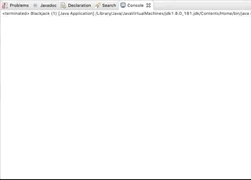
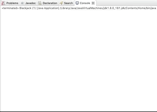

# Blackjack

A version of the traditional blackjack card game. This was an early programming assignment for CIT591 at UPenn.

## Getting Started

These instructions will get you a copy of the project up and running on your local machine for development and testing purposes.

### Prerequisites

You will need the following software to run this code:

```
Eclipse (or other Java IDE)
```
```
JDK
```
```
JUnit
```

### Installing

In order to use Java, you need to first install the Java Development Kit (JDK).

You’ll also need the Java Runtime Environment (JRE) which includes the
Java Virtual Machine (JVM).

You can download and install the JDK, which includes the JRE (and JVM) [here](https://www.oracle.com/technetwork/java/javase/downloads/jdk8-downloads-2133151.html)

Eclipse is one of two main IDEs for Java development.

You can download and install Eclipse [here](https://www.eclipse.org/downloads/)

Once Java and Eclipse are installed, download the src/slidePuzzle folder.

Create a new Java project in Eclipse:
```
File > New > Java Project
```

And name this project slidePuzzle. Within this project, create a new package:

```
File > New > Package
```

And name this package slidePuzzle. Within this package, create the 9 classes listed in the src folder and import the code.

## Playing the game

The ```main``` method is contained within Blackjack.java. 





## Versions

We used the following software versions:

* Java 8.0
* Eclipse Oxygen.2 Release (4.7.2)

## Authors

* **Catherine Weiss** - [GitHub](https://github.com/catherineweiss)


## License

This project is licensed under the MIT License.

## Acknowledgments

* Professor Kathleen Malone
* **Naomi Pohl** - *ReadMe* - [GitHub](https://github.com/naomipohl)
